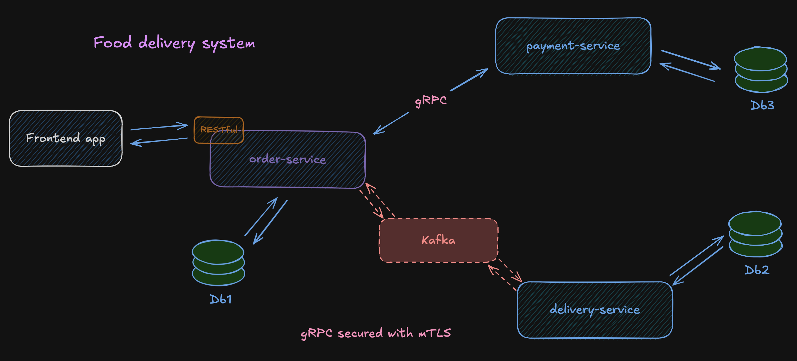

# 🍕 Food Delivery Service

---

A **microservices backend** for a food delivery platform, built with Java 21 and Spring Boot 3.
Demonstrates event-driven architecture with Kafka, synchronous gRPC communication secured
with mutual TLS, and a shared proto/DTO library.
---

## Architecture Overview

---

## Services

### 🧾 Order Service
Handles the full order lifecycle — from cart submission to fulfillment tracking.
- Exposes REST API for order creation and status management
- Publishes domain events to Kafka upon order confirmation
- Calls Payment Service synchronously over gRPC (mTLS)
- Consumes Kafka events from Delivery Service asynchronously

### 💳 Payment Service
Processes payment requests triggered by the Order Service.
- Validates and processes payments via a gRPC endpoint, secured with mutual TLS
- Maintains its own isolated payment records and transaction history

### 🚗 Delivery Service
Listens for confirmed orders and manages delivery dispatching.
- Consumes Kafka events from Order Service asynchronously
- Tracks delivery status independently of the order lifecycle
- Publishes events to Kafka about assigned delivery to orders

---

## Tech Stack

| Category | Technology                                          |
|---|------------------------------------------------------|
| Language | Java 21                                             |
| Framework | Spring Boot 3, Spring MVC, Spring Data JPA          |
| Inter-service Communication | gRPC (mTLS), Protocol Buffers                       |
| Messaging | Apache Kafka                                        |
| Database | PostgreSQL (per service)                            |
| ORM | Hibernate                                           |
| Shared Contracts | common-libs (proto definitions + generated stubs, shared DTOs) |
| Containerization | Docker, Docker Compose                              |
| Build Tool | Maven                                               |

---

## Key Design Decisions

**Database per Service** — Each service has its own PostgreSQL instance.
No shared schema, load is distributed across 3 separate databases,
each scalable independently.

**Shared proto/DTO library** — A standalone `common-libs` Maven module holds the `.proto`
service definitions (compiled into gRPC stubs at build time) alongside shared DTOs and enums.
This keeps the wire contract and shared types in one versioned artifact, consumed by every
service that needs them.

**Kafka for Order ↔ Delivery** — Order service publishes `OrderPaidEvent` once payment
is confirmed. Delivery service picks it up, assigns a courier, then publishes
`DeliveryAssignedEvent` back. Order service consumes it and updates
`orderStatus`, `etaMinutes` and `courierName`.

**gRPC + mTLS for Payments** — Payment confirmation is part of the order flow and requires
an immediate response. The Order → Payment call runs over gRPC for lower latency and a
strongly-typed contract, with mutual TLS so both services authenticate each other before
any payment data is exchanged.

---

## Getting Started

### Prerequisites
- Java 21+
- Docker & Docker Compose
- Maven 3.8+

### Run the full stack

```bash
git clone https://github.com/edelBrock89t/food-delivery-system.git
cd food-delivery-service

# Start infrastructure (PostgreSQL instances + Kafka)
docker-compose up -d

# Install shared library (generates gRPC stubs from common-libs/src/main/proto)
cd common-libs && mvn install && cd ..

# Start each service
cd order-service && mvn spring-boot:run &
cd payment-service && mvn spring-boot:run &
cd delivery-service && mvn spring-boot:run
```
---

## Project Structure

```
food-delivery-service/
├── common-libs/                  # Shared .proto definitions, generated gRPC stubs, DTOs
├── order-service/                # Order lifecycle management
├── payment-service/              # Payment processing
├── delivery-service/             # Delivery dispatching
└── docker-compose.yml            # Full local infrastructure
```

---

## Roadmap
- [x] Replace HTTP (Order ↔ Payment) with **gRPC** secured with **mTLS**
- [ ] Add distributed tracing with **Micrometer + Zipkin**
- [ ] Add **API Gateway** (Spring Cloud Gateway)
- [ ] Add another microservices like **client-service**, **auth-service (with JWT)**, **notification-service**, **warehouse-service**
- [ ] Add Redis caching
- [ ] Kubernetes deployment manifests

---

## Author

**IB**
Java Backend Developer
[LinkedIn](-) · [GitHub](https://github.com/edelBrock89t/)